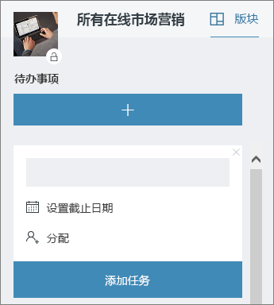

# 在办公室的会议Meeting at the Office

它是 10:00 和为会议的时间。在此部分中，我们将向您如何使您的会议更加高效地工作。 此步骤需要会议准备和 Office 365 工具的最佳做法。It's 10:00 AM and time for your meeting. In this section, we'll show you how to make your meetings more productive.  This involves best practices for meeting preparation and Office 365 tools.  

## 工具Tools
- OutlookOutlook
- Microsoft TeamsMicrosoft Teams
- Skype for BusinessSkype for Business
- OneNoteOneNote

## 您的会议的的清单Checklist for your meeting
- 规划和书籍会议Plan and book your meeting
- 加入会议Join a meeting
- 在会议中提供的信息Present information in a meeting
- 使用 OneNote 会议中进行共同创建和注释Use OneNote in a meeting for co-creation and notes
- 会议中使用计划工具来跟踪项目的拟办事项Use Planner in a meeting to track action items for that project
- 结束会议End a meeting
 
## 规划和书籍会议Plan and book your meeting
为可能是怎样才能确保您的会议，提高生产效率的几件事：There are a few things you can do to ensure your meeting is as productive as possible:

1. **您是否需要会议？** 请考虑与所需的审批者首次共享聊天中的文件。**Do you need a meeting?** Consider sharing a file in chat with the necessary approvers first.  
1. **已清除议程。** 在说明部分的联机会议邀请包括会议议程，因此与会者可以准备好。**Have a clear agenda.**  Include your meeting agenda in the notes section of your online meeting invitation so attendees can be prepared.
1. **记录您的会议** 使用会议录制函数中的 Microsoft 团队，与不能出席的人员共享会议或更高版本，理赔注释。**Record your meeting**  Use meeting recording functions in Microsoft Teams to share the meeting with people who could not attend or to transcribe notes later.  

现在您已准备好书籍该会议： 书籍与 Microsoft 团队会议或 for Business 的 Skype Outlook 中的详细信息。这样做，以便可以包括不同位置的工作组成员、 录制会议和利用 （如果可用） 的视频来增强通信。Now you're ready to book that meeting:  Book the meeting with Microsoft Teams or Skype for Business details in Outlook. Doing so enables you to include team members from different locations, record the meeting and utilize video (when available) to enhance communication. 

## 加入会议Join a meeting
从任何地方加入。也可以从任何地方使用移动设备，通过会议详细信息中的呼叫的电话拨入式号码，或使用移动应用程序的业务会议加入 Microsoft 团队或 Skype。当使用移动应用程序，为自觉移动数据使用率限制适用于您或您的国家/地区。Join from anywhere. It is possible to join a Microsoft Teams or Skype for Business meeting from anywhere using a mobile device, either by calling the dial-in number in the meeting details or using the mobile apps. When using the mobile apps, be conscious of mobile data usage limits that apply to you or your country.

> [!TIP]
> **使用耳麦。** 如果要从您的计算机连接在办公桌旁，使用耳机而不是计算机的内置麦克风和扬声器来确保更好的呼叫质量。**Use a headset.** If you are connecting from your computer at your desk, use a headset rather than your computer's built-in microphone and speakers to ensure a better call quality.

> [!TIP]
> 打开您的视频 ！当照相机可用时，值得使用它们，如面对面通信提供了可以时只使用语音的已错过的非语言线索。不要担心，您字形看起来很好。Turn on your video! When cameras are available, it's worth using them, as face-to-face communication provides non-verbal cues that can be missed when just using voice. Don't worry, your hair looks great. 

## 在会议中提供的信息Present information in a meeting
共享您的设备中的内容是重点会议并提供到讨论的上下文的好方法。一般情况下，共享整个屏幕，可以是个好主意。这意味着会显示在屏幕的一切将显示在屏幕的任何人参加会议。避免这只需选择要共享的 Microsoft 团队中的内容。Sharing content from your device is a great way to focus your meeting and provide context to the discussion. In general, sharing your entire screen can be a bad idea. It means that everything that comes up on your screen will appear on the screens of everyone attending the meeting. Avoid this by simply selecting the content you want to share in Microsoft Teams. 

## 使用 OneNote 会议中Use OneNote in a meeting
OneNote 可以允许的实时协作和共同创建，使其成为集体讨论的理想工具，并记下在会议中。只要每个人都可以访问其中共享 OneNote 位置，您可以发布到笔记本的链接和开始立即集体讨论。OneNote can allow for real-time collaboration and co-creation, making it an ideal tool for brainstorming and note taking in meetings. As long as everyone has access to the location where the OneNote is shared, you can post a link to the notebook and start brainstorming right away.

您可以创建会议笔记团队笔记本中的特定部分。您可以使用在 OneNote 中的"会议详细信息"功能来创建的会议的详细信息摘要网页。You can create a specific section for meeting notes in the team notebook. You can also use the "meeting details" functionality in OneNote to create pages with a summary of the details of the meeting.

## 在会议中使用计划程序Use Planner in a meeting
直接将操作项添加到项目计划保存从转录这些后这一事实。它是大型项目会议某人分配跟踪 & 笔记记录的操作中的最佳做法。这通常是另一个人比各运行会议。直接向各，它为其分配，如果项通过截止日期，则提醒发送操作项提醒。Directly adding action items into a plan for your project saves you from transcribing them after the fact. It's a best practice in large project meetings to assign someone to action tracking & note taking. This is normally a different person than the individual running the meeting. Action item reminders are sent directly to the individual to whom it is assigned as are reminders if the item passes it's due date. 

## 结束会议End a meeting
当议程上的所有内容讨论了时，结束会议，而不考虑时间。分配并向所有参与者发送拟办事项。如果您的 Microsoft 团队中的协作，您可以轻松地共享适当的频道中的操作项。拟办事项还可以输入和计划程序中分配会议期间，提供一种快速完成其也可以是[在 Microsoft 团队中访问](https://support.office.com/en-us/article/use-planner-in-microsoft-teams-62798a9f-e8f7-4722-a700-27dd28a06ee0)跟踪方法。When everything on the agenda has been discussed, end the meeting, regardless of the time. Assign and send action items to all participants. If you are collaborating in Microsoft Teams, you can easily share action items in the appropriate channel. Action items can also be entered and assigned in Planner during the meeting, providing a fast way to track for completion which can also be [accessed in Microsoft Teams](https://support.office.com/en-us/article/use-planner-in-microsoft-teams-62798a9f-e8f7-4722-a700-27dd28a06ee0). 