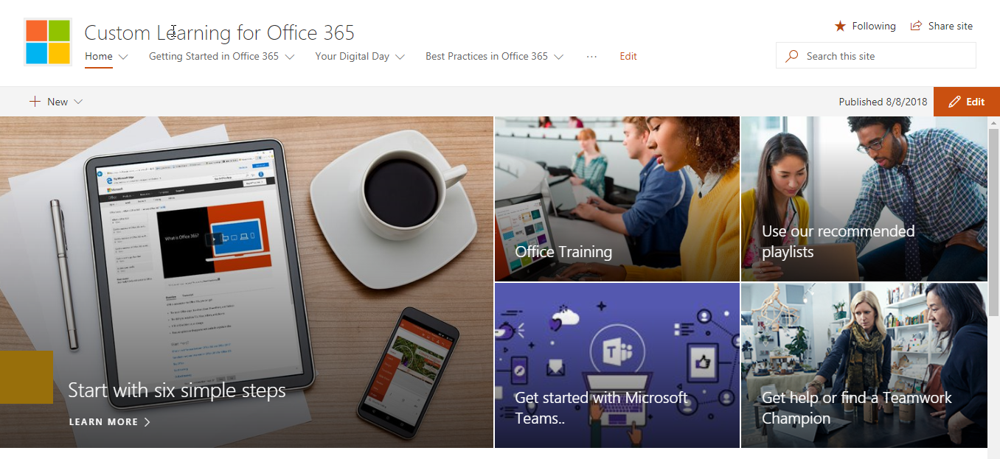
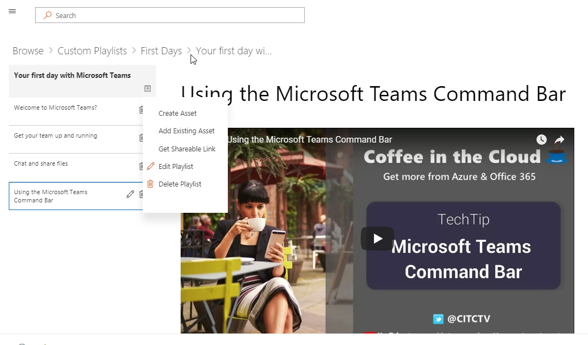

# 自定义 Office 365 的学习Custom Learning for Office 365

## 自助服务，可自定义培训解决方案 （英文） MicrosoftSelf service, customizable training solutions from Microsoft

自定义 Office 365 学习是一的培训和采用开放源代码工具旨在提高您的组织中的 Office 365 的使用情况。创建与 Microsoft 团队和 SharePoint 产品工程组和现代协助和体验团队合作，这些简单易用的解决方案可以安装，并自定义 SharePoint Online 租户中。Custom Learning for Office 365 is a set of training and adoption open source tools designed to increase usage of Office 365 in your organization. Created in partnership with Microsoft Teams and SharePoint Product Engineering groups and the Modern Assistance and Experience team, these simple-to-use solutions can be installed and customized in your SharePoint Online tenant. 

这些解决方案将所有培训内容 Microsoft 提供和保持内容最新按需型都置于最终用户。 可以轻松地与所安装的 Microsoft 团队或公司内的其他现有 SharePoint Online 网站集成，网站。These solutions bring to your end-users all the training content that Microsoft has to offer and keeps that content up to date on demand.  The site can easily be integrated with your installation of Microsoft Teams or other existing SharePoint Online sites in your company.

我们的自定义学习内容当前范围限定为开始 Office 365 产品的内容。 如果您希望看到包含更多的内容，请向我们提供[建议和反馈](feedback.md)中我们 online 论坛。Our custom learning content is currently scoped to beginning content for Office 365 products.  If you'd like to see more content included, give us [suggestions and feedback](feedback.md) in our online forum.  

## 自定义学习打开源组件Custom Learning Open Source Components

自定义 Office 365 学习提供两个选项：Custom Learning for Office 365 provides two options: 

**选项 1**：[了解 SharePoint Online 网站程序包的自定义](installsitepackage.md)**Option 1**: [The Custom Learning SharePoint Online Site Package](installsitepackage.md)

选择、 安装和配置此 SharePoint Online 的通信网站包创建您的公司的培训门户。以前称为 Toolkit for 团队合作，此培训门户可以自定义添加贵组织的帮助和支持社区内容。您还可以删除与贵组织中不支持的服务相关的任何内容。自定义学习网站程序包还包括提供到您的组织的 Office 365 培训内容的最新订阅源的自定义学习 web 部件。Select, install, and configure this SharePoint Online communication site package to create a training portal for your company. Formerly known as Toolkit for Teamwork, this training portal can be customized to add your organization's help, support, and community content. You can also remove any content related to services not supported within your organization. The custom learning site package also includes the Custom Learning web part that provides an up-to-date feed of Office 365 training content to your organization. 

**选项 2**：[为 Office 365 web 部件的自定义学习](installwebpart.md)自定义学习 web 部件选项专为想要将 Office 365 培训集成到现有的 SharePoint Online 的通信网站的组织。自定义学习 web 部件可以安装在 SharePoint Online 的任何页上，并提供的整套 Office 365 培训内容从 Microsoft 的 Support.Office.com 网站保持最新的订阅源。培训提供通过 web 部件内容组织在轻松使用播放列表中。管理员还可以使用 web 部件来构建自定义培训播放列表组合中 YouTube，如本地承载内容的内容。Pdf 和 Office 365 培训内容以提供培训体验适合组织的唯一需求。**Option 2**: [The Custom Learning for Office 365 web part ](installwebpart.md) The Custom Learning web part option is designed for organizations that want to integrate Office 365 training into an existing SharePoint Online communication site. The Custom Learning web part can be installed on any SharePoint Online page and provides an up-to-date feed of the full suite of Office 365 training content from Microsoft's Support.Office.com site. Training content delivered through the web part is organized in easy-to-consume playlists. Administrators can also use the web part to build custom training playlists, combining content from YouTube, locally hosted content like .PDFs, and Office 365 training content, to provide training experiences tailored to the unique needs of the organization.

## 3 个简单步骤3 Easy Steps

允许[开始](prereqs.md)使用最新的 Microsoft 内容创建简单的培训解决方案。Lets [get started](prereqs.md) creating a simple training solutions with up to date Microsoft content.

1. 为您选择的解决方案权限Select the solution right for you
2. 完成安装 & 自定义您的内容Complete your installation & customize your content
3. 与用户使用我们的[应用工具](driveadoption.md)共享您的网站Share your site with your users using our [adoption tools](driveadoption.md)
