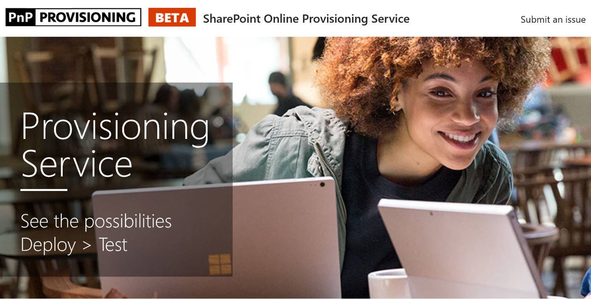

# 设置自定义学习网站

1. 转到http://provisioning.sharepointpnp.com并且使用您的凭据的目标租户登录计划安装使用。
1. 关闭代表您的组织的许可检查并选择接受。
1. Office 365 解决方案库中，选择自定义学习。 
1. 选择将添加到您的租户 
1. 调整为必需和选择设置时已准备好安装到您的租户环境 CLO365 设置页上的默认选择。  
1. 设置的过程需要 15 分钟。通过电子邮件 （到设置页输入的通知电子邮件地址） 将通知您网站何时准备好进行访问。 
1. 一次登录到 CLO365 中您的租户，喜欢网站，并将复制的 url 以供将来参考。  

## 后续步骤
- 浏览包括 web 部件中的[默认内容](sitecontent.md)。
- [自定义](customization.md)您的组织的培训体验。
- 培训解决方案的[驱动器应用](driveadoption.md)。

