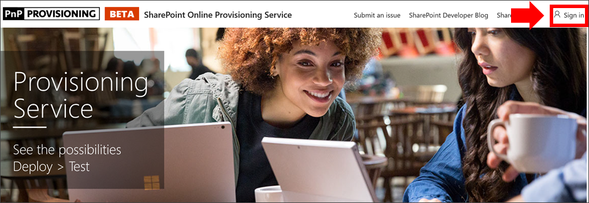

# 预配自定义学习网站

1. 从主页http://provisioning.sharepointpnp.com的右上角转到并**登录**。 使用您计划安装网站模板的目标租户的凭据登录。

2. 清除**代表您的组织的同意**并选择 "**接受**"。

3. 从解决方案库中选择**适用于 Office 365 的自定义学习**。

4. 从解决方案主页中选择 "**添加到你的租户**"

5. 根据您的安装需要填写 "设置信息" 页上的字段。至少应输入你希望获取有关设置过程的通知的电子邮件地址和要设置为的网站的目标 URL。  

> [!NOTE]
> 将网站的目标 URL 设置为友好的内容, 如 "/sites/MyTraining" 或 "/teams/LearnOffice365"。

6. 在准备好将 CLO365 安装到你的租户环境中时, 选择 "**设置**"。 预配过程最长需要15分钟。当网站准备好访问时, 将通过电子邮件通知你 (到您在 "设置" 页上输入的通知电子邮件地址)。

7. 当你已通知设置完成时, 请浏览到在 "设置" 页中输入的目标 URL。

8. 将网站放在右上角并为 URL 加上书签, 以供将来参考。  

### 后续步骤
- 浏览 web 部件中包含的[默认内容](sitecontent.md)。
- 为你的组织[自定义](customization.md)培训体验。
- [促进](driveadoption.md)培训解决方案的采用。
