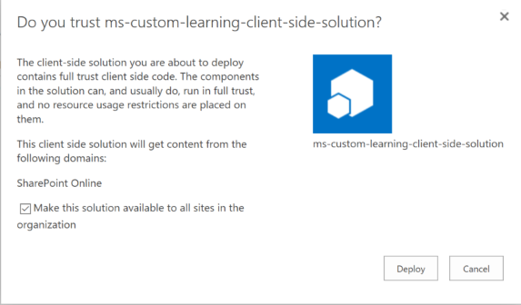
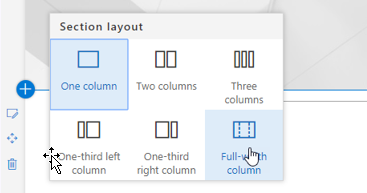
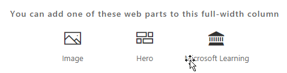

# 安装自定义学习解决方案 web 部件Installing the Custom Learning Solution Webpart

## 租户范围安装的先决条件Prerequisites for a tenant-wide installation

- 若要为你的整个租户安装自定义的学习 web 部件, 你需要具有 Office 365 管理权限。 如果您没有这些权限, 则可以与 Office 365 管理员合作, 也可以为单个网站集安装 web 部件。To install the Custom Learning webpart for your entire tenant you will need to have Office 365 Administrative permissions.  If you do not have these permissions you can either work with your Office 365 Administrator or install the webpart for an individual site collection.
- 您或您的 Office 365 管理员必须已安装并配置了租户范围的[应用程序目录](https://docs.microsoft.com/en-us/sharepoint/dev/spfx/set-up-your-developer-tenant)或[网站集应用程序目录](https://docs.microsoft.com/en-us/sharepoint/dev/general-development/site-collection-app-catalog), 才能接收 web 部件。]You or your Office 365 Administrator must have setup and configured a tenant-wide [App Catalog](https://docs.microsoft.com/en-us/sharepoint/dev/spfx/set-up-your-developer-tenant) or a [Site Collection App Catalog](https://docs.microsoft.com/en-us/sharepoint/dev/general-development/site-collection-app-catalog)to receive the webpart.]
- 我们仅支持 SharePoint Online。web 部件不支持在本地的任何 SharePoint 版本上安装。We support SharePoint Online only. The web part is not support for installation on any version of SharePoint on premises.

## 将自定义学习 web 部件添加到租户Add the Custom Learning webpart to your tenant 

1. 下载自定义学习 web 部件并将其保存到本地驱动器。 此文件名为 "ms-自定义 .sppkg"。 不要更改文件的名称或后缀。Download the Custom Learning webpart and save it to your local drive.  This file is named "ms-custom-learning.sppkg".  Do not change the name or suffix of the file. 
2. 导航到适用于租户的[Office 365 管理门户](https://admin.microsoft.com/AdminPortal/Home#/homepage)Navigate to the [Office 365 Admin portal](https://admin.microsoft.com/AdminPortal/Home#/homepage) for your tenant
3. 从左侧导航中选择 "管理中心"、"SharePoint"。这将在新选项卡中打开。, 在 SharePoint 管理中心中选择 "应用程序"、"应用程序目录" 和 "SharePoint 相关应用程序"From the left navigation select Admin Centers, SharePoint. This will open in a new tab. , In the SharePoint Admin Center select Apps, App Catalog, Apps for SharePoint 
4. 选择 "上载 web 部件", 然后选择您下载的 "ms-自定义 .sppkg" 文件Select upload the webpart and choose the "ms-custom-learning.sppkg" file you downloaded
5. 对于此租户范围的安装, 请选中 "使此解决方案可供组织中的所有公司使用" 旁边的复选框。For this tenant-wide installation check the box next to "Make this solution available to all sits in the organization."  
 
> [!NOTE]
> 安装 webpart 后, 即可在 SharePoint Online 的 web 部件库中找到它。 **在库中, web 部件名为 "Microsoft 学习"**Once the webpart is installed you will find it in your webpart gallery in SharePoint Online.  **In the gallery the webpart is named "Microsoft Learning"**

## 将 Microsoft 学习 web 部件添加到 SharePoint Online 页面Add the Microsoft Learning webpart to a SharePoint Online Page

在租户中安装自定义学习后, 可以将 Web 部件添加到 SharePoint 页面。当你执行 Office 365 和 Windows 10 培训时, 你的网站可供你使用。After Custom Learning is installed in your tenant you can add the Web part to a SharePoint page. When you do Office 365 and Windows 10 training is available to your site.

1. 在全宽列布局中添加自定义学习 web 部件:Add the Custom Learning webpart in a full width column layout:

2. 在 SharePoint 页面中, 选择 "添加内容", 然后选择 "全宽列"。 您将看到以下提示:In the SharePoint page, select Add section and then select full width column.  You'll see the following prompt:

3. 选择 "Microsoft 学习"。 您现在应该会看到以下内容:Select Microsoft Learning.  You should now see the following: 

 您现在可以单击磁贴来浏览解决方案中包含的默认内容。You can now click on the tiles to explore the default content included in the solution.  

### 后续步骤Next Steps
- 浏览 web 部件中包含的[默认内容](webpartcontent.md)。Explore the [default content](webpartcontent.md) included in the webpart.
- 为你的组织[自定义](customization.md)培训体验。[Customize](customization.md) the training experience for your organization.
- [促进](driveadoption.md)培训解决方案的采用。[Drive adoption](driveadoption.md) of your training solution.

