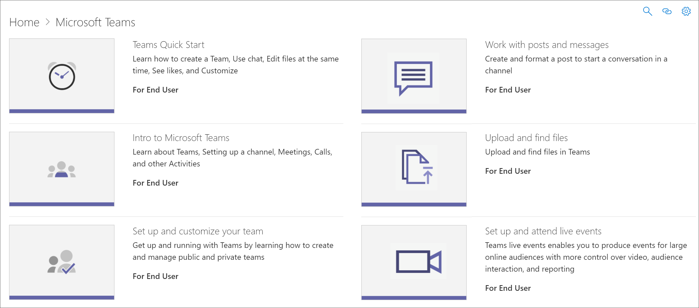

# 如何隐藏和显示播放列表How to hide and show Playlists

若要定制环境的学习路径，你可能需要隐藏 Microsoft 提供的播放列表，并将其替换为你为组织创建的播放列表。To tailor learning pathways for your environment, you may need to hide playlists provided by Microsoft and replace them with playlists that you create for your organization. 例如，一个常见的客户用例是隐藏 Microsoft 的六个简单步骤播放列表，并将其替换为你为组织或用户组创建的播放列表。For example, a common customer use case is to hide the Six Simple Steps playlist from Microsoft and replace it with a playlist that you create for your organization or user group. 

## 隐藏播放列表Hide a playlist

1. 从学习路径 **主页中** ，单击 Office **365 培训** 磁贴。From the learning pathways **Home** page, click the **Office 365 training** tile.
2. 从学习路径 Web 部件中，选择"**系统**"菜单，然后选择"**管理播放列表"。**From the learning pathways web part, select the **System** menu, then select **Administer Playlist**. 现在应打开两个选项卡：一个选项卡包含 **学习路径管理** 页;一个包含 **Office 365 培训** 页面。You should now have two tabs open: One with the **learning pathways Administration** page; and one with the **Office 365 training** page. 
3. 从"**自定义学习管理**"页的"类别"下，选择一个子类别，然后为播放列表选择"眼球"以隐藏它。From the **Custom Learning Administration** page, under **Category**, select a subcategory, and then select the eyeball for a playlist to hide it. 对于此示例，单击" **第一天** "子类别，然后隐藏" **六个简单的步骤"** 播放列表。For this example, click the **First Days** subcategory, and then hide the **Six Simple Steps** playlist.  

### 验证播放列表是否隐藏Verify the playlist is hidden
- 若要验证播放列表是否隐藏，请选择加载了 Office **365** 入门页面的浏览器选项卡，然后刷新页面。To verify the playlist is hidden, select the browser tab with the **Get Started with Office 365** page loaded, and then refresh the page. 现在，应该会看到" **第一天** "子类别和 **"六个简单的步骤"** 处于隐藏状态。You should now see the **First Days** subcategory and **Six Simple Steps** is hidden. 在这种情况下，子类别只有一个播放列表，并且该播放列表是隐藏的，因此学习路径还会隐藏子类别，而不是显示空的子类别。In this case, there is only one playlist in the subcategory and it's hidden, so learning pathways also hides the subcategory rather than display an empty subcategory. 

## 取消隐藏播放列表Unhide a playlist

- 从"**自定义学习管理**"页的"类别"下，选择一个子类别，选择一个播放列表，然后选择隐藏播放列表的目视球将其取消隐藏。From the **Custom Learning Administration** page, under **Category**, select a subcategory, select a playlist, and then select the eyeball for the hidden playlist to unhide it. 对于此示例，取消隐藏"第一天"**子类别下的**"六个简单步骤"播放列表。For this example, unhide the **Six Simple Steps** playlist under the **First Days** subcategory.  

