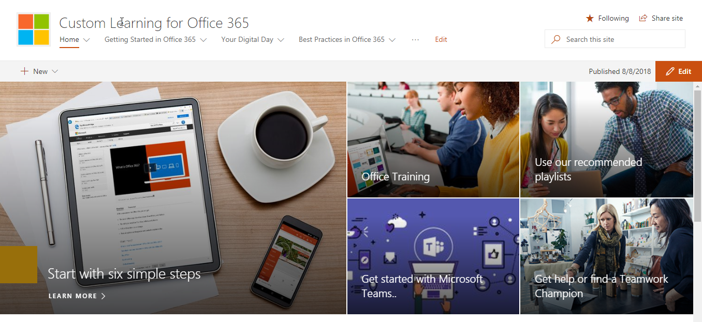

# 浏览网站和默认内容

### 浏览网站 

导航到主页, 然后选择 "Office 365 培训"。SharePoint Online 网站中的每个页面都配置为承载 Microsoft 学习 web 部件。这使页面能够显示 web 部件中所有可用的内容。

从菜单栏中, 选择导航项 " **Office 365 培训**", 然后选择 "**从 OneDrive 开始使用**"。在这种情况下, Web 部件会对内容进行筛选, 以便仅显示 OneDrive 内容。

对其他两个菜单选项重复这些步骤,**从团队开始**,**开始使用 SharePoint Online**查看其内容并测试导航。

导航回主页, 并选择 "**从六个简单步骤开始**"。这将转到六个简单的步骤播放列表。

> [!TIP]
> 从 Microsoft 研究团队派生的六个简单步骤。这些是 Microsoft 研究人员发现最多的步骤, 这意味着, 如果用户执行这些步骤, Office 365 的使用将会增加, 并且这些步骤将成为更高效率的工作人员。这一点对大家来说都非常出色。

### 从六个简单的步骤开始转到 "开始"
- 在主页中, 单击 "从六个简单的步骤开始"。 
- 您将看到 "Office 培训" 页面, 其中自定义学习 web 部件将通过六个简单的步骤播放列表路由到 "开始"。  

### 查看类别的播放列表列表

从 "Office 365 培训" 页面选择 "excel 培训" 以转到 excel 培训播放列表列表。

### 查看播放列表

单击 "**欢迎使用 Excel** " 以查看播放列表

您的网站现在已设置为在每个页面上显示正确的内容。 

## 后续步骤
- [自定义网站内容](customization.md)
- [推动采用](driveadoption.md) 
