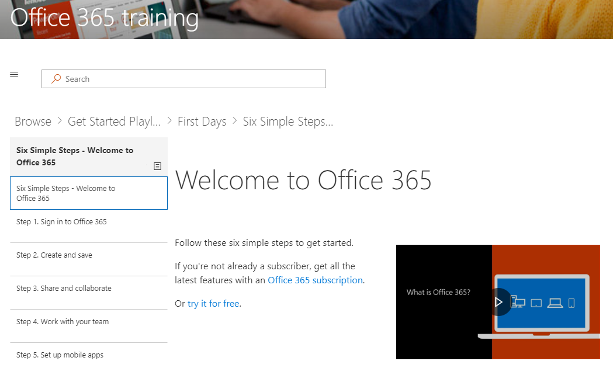

# 浏览网站和默认内容Browse the site and default content

现在，已安装 CLO365，就可以浏览网站。Now that you’ve installed CLO365, it’s time to take a tour of the site. 

1. 导航到主页，然后选择 Office 365 培训。这将显示在 Web 部件中可用的所有内容。Navigate to the Home page and select Office 365 Training. This will display all the content available within the Web part.

2. 从菜单栏中，指向 Office 365 培训，然后选择 Get Started with OneDrive。在这种情况下，Web 部件筛选器的内容显示仅 OneDrive 的内容，如下图所示。From the menu bar, point to Office 365 Training and then select Get Started with OneDrive. In this case, the Web part filters the content to show only OneDrive content, as shown in the following illustration.

{插入图像}{insert image}

3. 对于其他两个菜单选项，入门团队和 Get Started with SharePoint Online，查看其内容和测试导航重复这些步骤。Repeat these steps for the other two menu options, Get Started with Teams and Get Started with SharePoint Online to review their content and test the navigation.

{插入图像}{insert image} 

4. 导航回主页页上，然后选择开始六个简单的步骤。您将转到六个简单步骤播放列表如下图所示。Navigate back to the Home page and select Start with Six Simple Steps. This takes you to the Six Simple Steps playlist as shown in the following illustration.  

> [!TIP]
> 从 Microsoft 研究小组派生六个简单的步骤。这些是 Microsoft 研究人员找到要最可靠的步骤，这意味着，如果用户通过以下步骤，他们使用的 Office 365 会增加，他们将变得更为高效工作人员。这也适用于每个人。The six simple steps are derived from a Microsoft research team. These are the steps that Microsoft researchers have found to be the most sticky, meaning if users go through these steps, their use of Office 365 will increase and they will become more productive workers. And that’s good for everybody.

转首先六个简单的步骤Go to Start with six simple steps
- 从主页页上，与六个简单步骤中单击开始。From the Home page, click Start with six simple steps. 
- 对路由到六个简单步骤播放列表开始学习自定义 web 部件，您看到的 Office 培训页面。You see the Office Training page with the Custom Learning web part routed to the Start with six simple steps playlist.  

现在使用正确的内容显示在每页上设置您的网站。如果您想要自定义网站上的培训内容，请参阅自定义学习有关自定义 Office 365 管理员指南。Your site is now set up with the correct content being displayed on each page. If you would like to customize the training content on the site, please see Custom Learning for Office 365 Administrator Guide to Customization. 

## 后续步骤Next Steps
[自定义网站内容](customization.md)
[驱动器应用](driveadoption.md)[Customize site content](customization.md)
[Drive adoption](driveadoption.md) 
