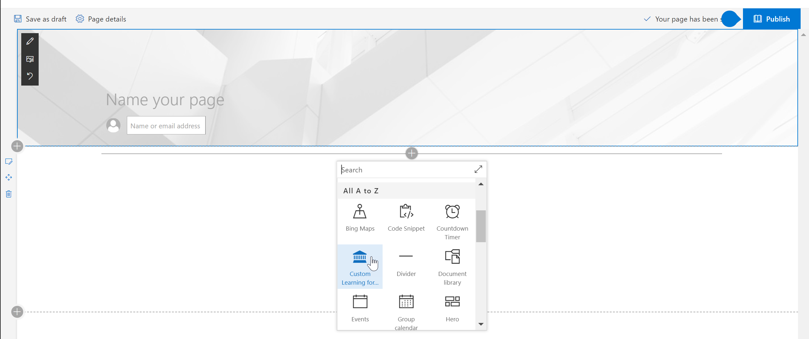
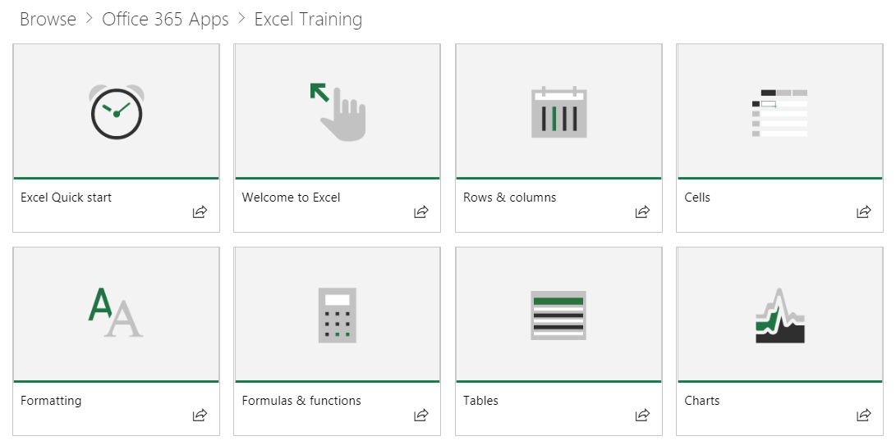
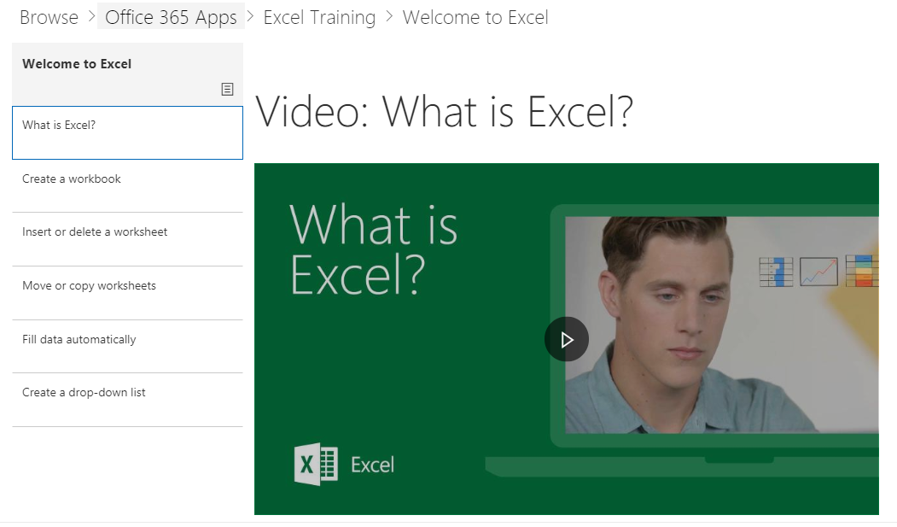

# Web 部件默认内容Webpart default content

## 播放列表模型The Playlist Model

我们的 Web 部件使用熟悉的播放列表模型来组织内容。Our webpart uses a familiar playlist model to organize the content.  此模型对于最终用户来说很简单，并且您可以在您选择进行自定义时进行自定义。This model is simple for your end users to understand and for you to customize should you choose to.  不需要自定义。Customization is not required.  我们开箱即用的体验基于我们广泛的研究为您提供了有效的培训内容。Our out of the box experience provides you with effective training content based on our extensive research.

这些播放列表旨在帮助组织为用户定制学习体验，并为用户提供易于使用的播放列表，以向用户介绍新的、更高效的行为。These playlists are designed to help organizations tailor the learning experience for users and present them with easy-to-consume playlists to teach them new, and more productive behaviors. 服务内容来自 Support.Office.com，资产简短明了，包含丰富且极具吸引力的视频。The serve content from Support.Office.com, and the assets are short and sweet, with peppy, engaging videos. 

每个磁贴表示单个特色播放列表或内容类别。Each tile represents either an individual featured playlist or a content category. 单击任何播放列表或类别磁贴可快速将用户导航到选定区域。Clicking on any playlist or category tile quickly navigates the user into the selected area. 下图显示了"入门播放列表"和 Office 365 应用类别（如 Excel、Microsoft Teams 和其他类别）下两个特别推荐的列表。The graphic below shows both featured lists under "Get Started Playlist" and Office 365 App categories like Excel, Microsoft Teams and others. 

单击 Excel 类别以导航到播放列表集合。Clicking the Excel category for instance navigates them to a collection of playlists.  他们可以有序地观看内容，或根据他们的学习需求选择他们感兴趣的内容。They can watch content in order or select what interests them based on their learning needs. 

选定的播放列表视图Selected playlist view

## 后续步骤Next Steps

- 浏览并熟悉现有内容Browse and familiarize yourself with the existing content
- 隐藏和显示播放列表 [自定义播放列表](custom_hideshowplaylists.md)Hide and show Playlists [customize playlists](custom_hideshowplaylists.md)
